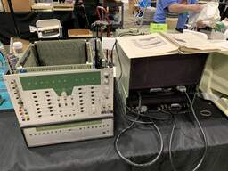
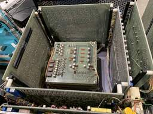
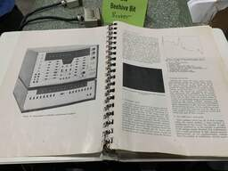

# ND130 512 Channel Analyzer

The ND130 was a multichannel analyzer implemented with discrete transistors
and used a core memory plane for the channel data.

# Documentation

- [512 Channel Analyzer Model ND 130A Instruction Manual](docs/512_Channel_Analyzer_Model_ND_130A_Instruction_Manual_26-May-1961.pdf)
- [Tape Control Unit Model ND-305 Operating Instructions](docs/Tape_Control_Unit_Model_ND-305_Operating_Instructions_16-May-1961.pdf)

# Images

ND130 at Vintage Computer Festival Midwest 19 (2024)

