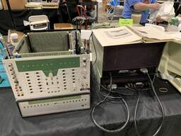
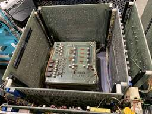
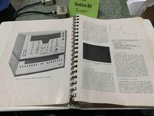
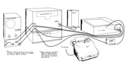
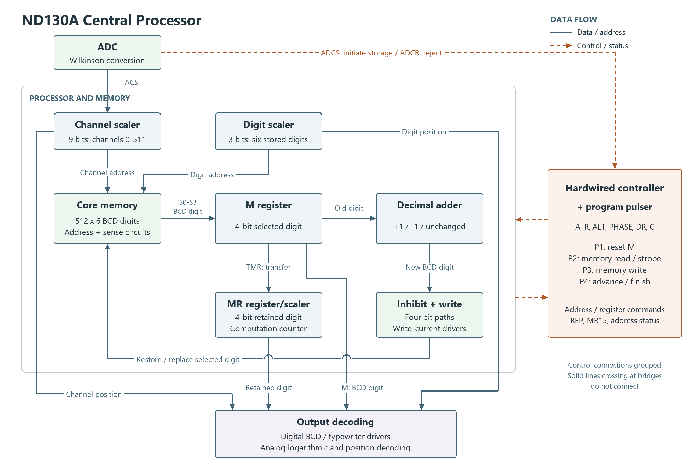

# ND130 512 Channel Analyzer

The ND130 was a multichannel analyzer implemented with discrete transistors
and used a core memory plane for the channel data.

# Documentation

- [512 Channel Analyzer Model ND 130A Instruction Manual](docs/512_Channel_Analyzer_Model_ND_130A_Instruction_Manual_26-May-1961.pdf)
- [Tape Control Unit Model ND-305 Operating Instructions](docs/Tape_Control_Unit_Model_ND-305_Operating_Instructions_16-May-1961.pdf)

# Images

ND130 at Vintage Computer Festival Midwest 19 (2024)

ND130 connection diagram

# Architecture

The ND130A implements a **hardwired, serial-decimal computer** whose memory
holds the spectrum. Its controller sequences the same registers, arithmetic
circuit, and memory drivers for pulse counting, readout, spectrum
addition/subtraction, and integration. There is no instruction-fetch mechanism:
the Boolean equations in Section IX are implemented directly by transistor and
diode circuits.

The diagram below shows the central processor. **Solid arrows carry data or
addresses; dashed arrows carry commands and status.** The controller's
connections to the processor are grouped for clarity.

Each channel contains **six decimal digits**, encoded as four-bit BCD. The
capacity is therefore 3,072 digit locations, or 12,288 stored bits. The
memory-address schematics explain the physical organization: one selector
chooses among **48 lines**, using the three low channel bits and six digit
positions; the other chooses among **64 lines**, using the remaining six channel
bits. Their intersections address four core planes simultaneously. The
three-bit digit scaler also has states 6 and 7, which the controller uses as
sequencing markers outside the six stored digit positions. These details appear
on PDF pages 36-37 and schematic pages 71-72.

A detector event first passes through the amplifier, shaping circuits, and ADC
linear gate. The Wilkinson ADC captures the pulse peak on a capacitor and
discharges it at approximately constant current. During the discharge, gated
**2 MHz** pulses advance the channel scaler through `ACS`; the resulting channel
address represents pulse height. When conversion finishes, `ADCS` requests a
memory operation. The ADC remains blocked until storage completes, so dead time
includes both conversion and arithmetic.

For an ordinary accepted event, the processor increments the addressed channel
starting with its least significant digit:

| Phase | Operation |
| --- | --- |
| `P1` | Clear M before receiving the next digit. |
| `P2` | Apply memory-read currents and strobe the sense outputs into M. Reading clears the selected cores. |
| Between read and write | The combinational adder produces the incremented, decremented, or unchanged digit. |
| `P3` | Write the result into the same location, using the four inhibit circuits to determine the stored bits. |
| `P4` | Advance to another digit if carry/borrow is required, or finish and reset the addressing sequence. |

Thus `000099 + 1` takes three digit cycles: write units `9 -> 0`, tens `9 -> 0`,
then hundreds `0 -> 1`. Most counts require only one cycle. The manual gives
roughly four-microsecond phase spacing and approximately 18 microseconds for
typical storage. Serial operation saves hardware: only four sense channels,
four M flip-flops, and one digit arithmetic circuit are needed.

`ALT`, the **ALTER flip-flop**, decides whether arithmetic changes memory.
Group overflow (`AO`) or ADC rejection (`ADCR`) clears it, causing a complete
read-and-restore cycle with unchanged data. Completing that cycle also performs
the normal cleanup. One particularly revealing detail is that M is subsequently
set to **2**: this prevents a leftover 9 or 0 from accidentally triggering carry
or borrow when arithmetic is enabled again.

The mode flip-flops change which conditions initiate cycles and advance
addresses. Section IX expresses these conditions as AND, OR, and complement
operations; the numbered circuits on Control Boards A and B implement them.
For example, `ADD = ADDSW AND ALT`, while subtraction uses the opposite switch
selection with `ALT`. The program pulser supplies the timed phases, and the
surrounding gates determine what each phase does in the current mode.

Readout uses the same destructive-read/restore loop with arithmetic disabled.
Digital readout visits the digits most significant first and drives BCD outputs
or typewriter digit solenoids. The oscillator changes speed for typing,
punching, and dumping; the phase logic also sequences spaces and carriage
returns. Analog readout searches for the leading nonzero digit, retains it in
MR, and reads the following digit into M. Weighted resistor networks and
logarithmic diodes combine those digits with their decimal position to generate
vertical deflection; the channel scaler supplies horizontal deflection. A
second phase synthesizes decade calibration lines. Zero is displayed at the
one-count level.

The **ND130A data-reduction extension** gives MR another role. Reading the
logic table together with the schematics shows the controller alternating
between the right-hand **donor** half and left-hand **acceptor** half by
controlling channel bit `C8`. A donor digit is transferred into MR; MR is then
stepped while repeated unit operations alter the corresponding acceptor digit.
`MR15` is a termination condition, and the separate `C` flip-flop retains
carry/borrow between decimal positions. The multiplier circuitry shifts the
digit alignment for factors such as `0.1`, `0.01`, and `0.001`. Functionally,
ordinary channel pairs perform
`acceptor += or -= truncated(multiplier * donor)`. Fractional counts are
discarded on each pass, and the manual warns that the clock channel is not
preserved normally during these operations.

Integration reuses that transfer process. The start/end switches decode channel
addresses and control a range latch. During an included acceptor operation, the
**force-to-channel-1** circuitry temporarily overrides the address outputs so
every selected donor channel contributes to the same sum channel. The
underlying scaler retains the scanning position. Full integration excludes the
donor group's first channel and places the sum in acceptor channel 1.

Live-time measurement also shares the counting machinery. Periodic, oversized
"tagged" clock pulses enter through the ADC gate. Recognized clock pulses
suppress address advances and request storage in channel zero; pulses arriving
while the analyzer is unavailable are rejected. The default rate is 10,000
pulses per minute, so channel zero records sampled live time. Autostop detects
the selected threshold using digit position and M contents.

The connector lists confirm the physical data flow: ADC connector
**A18 -> Address E7** carries `ACS`, **A8 -> Control BR18** carries `ADCS`, and
**A6 -> Control HR1** carries `ADCR`. Address connectors W/X/Y distribute channel
and digit selections to memory; MR connector Z carries the four sense and
inhibit paths. The schematics place the registers and adder on the MR board,
the sense/inhibit circuits in the memory assembly, and sequencing logic on
Control A/B.

References are to **PDF page numbers** in the
[instruction manual](docs/512_Channel_Analyzer_Model_ND_130A_Instruction_Manual_26-May-1961.pdf).
The visually checked computer-logic table on PDF page 48 is especially useful:
some prose is inherited from the ND120 and understates MR's role in the ND130A
computation circuitry.
