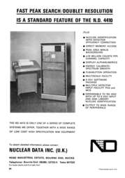
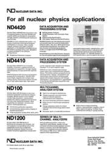
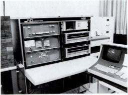

# ND4400 Series Multichannel Analyzers

The ND4400 series multichannel analzyers incorporate an [ND812](../ND812/ND812.md) minicomputer
as part of a complete system.

ND 4400 series multichannel used to analyze gunshot residue (GSR) in a crime lab in 1986.
From ["A Review of the FBI Laboratory's Gunshot Primer Residue Program"](docs/A_Review_of_the_FBI_Laboratorys_Gunshot_Primer_Residue_Program_Apr1986.pdf), John W. Kilty,
_Crime Laboratory Digest_, Volume 13, No. 2, April 1986.