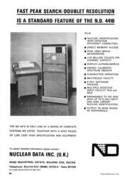
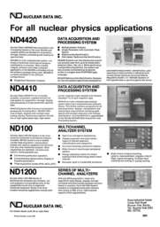
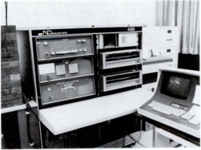

# ND4400 Series Multichannel Analyzers

The ND4400 series multichannel analyzers incorporated an
[ND812](../ND812/ND812.md) minicomputer as part of a complete system. The
ND4400 was a single-detector gamma-ray spectroscopy system. Software could be
written in ND812 assembly language or NUTRAN; a FORTRAN implementation became
available later but was reportedly not very successful.

A former Nuclear Data Product Support Manager recalled using and programming
an ND4400 while working at the University of Michigan before joining Nuclear
Data.

ND 4400 series multichannel used to analyze gunshot residue (GSR) in a crime lab in 1986.
From ["A Review of the FBI Laboratory's Gunshot Primer Residue Program"](docs/A_Review_of_the_FBI_Laboratorys_Gunshot_Primer_Residue_Program_Apr1986.pdf), John W. Kilty,
_Crime Laboratory Digest_, Volume 13, No. 2, April 1986.

## References

- [Nuclear Data ND 6600 and ND 600](https://geekhack.org/index.php?topic=36435.0),
  post by former Nuclear Data Product Support Manager "ND6600," February 28,
  2013.
