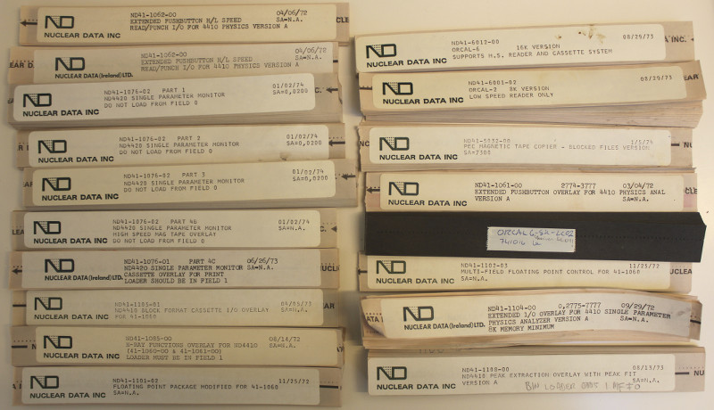
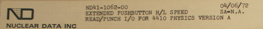
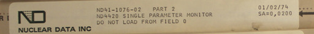
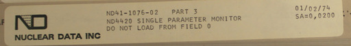
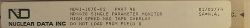
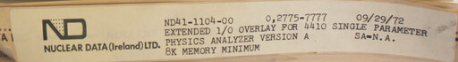
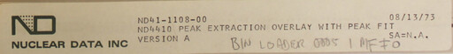
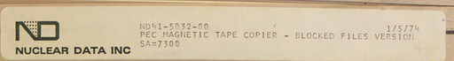

# ND4400 Paper Tape Images

Original source: [ND4420_paper_tapes.zip](https://bitsavers.org/bits/NuclearData/ND4420/ND4420_paper_tapes.zip)
on bitsavers.

Filenames have been adjusted to reflect the label images.

| Tape Image | Date | Label |
|:---------|:-----|:------|
| [ND41-1061-00](bin/ND41-1061-00_EXTENDED_PUSHBUTTON_OVERLAY_FOR_4410_PHYSICS_ANAL_VERSION_A.bin) | 03/04/72 | 
| [ND41-1062-00](bin/ND41-1062-00_EXTENDED_PUSHBUTTON_HL_SPEED_READ_PUNCH_IO_FOR_4410_PHYSICS_VERSION_A.bin) | 04/06/72 | 
| [ND41-1076-01](bin/ND41-1076-01_PART4C_ND4420_SINGLE_PARAMETER_MONITOR_CASSETTE_OVERLAY_FOR_PRINT_LOADER_SHOULD_BE_IN_FIELD_1.bin) | 06/26/73 | 
| [ND41-1076-02](bin/ND41-1076-02_PART1_ND4420_SINGLE_PARAMETER_MONITOR_DO_NOT_LOAD_FROM_FIELD_0.bin) | 01/02/74 | 
| [ND41-1076-02](bin/ND41-1076-02_PART2_ND4420_SINGLE_PARAMETER_MONITOR_DO_NOT_LOAD_FROM_FIELD_0.bin) | 01/02/74 | 
| [ND41-1076-02](bin/ND41-1076-02_PART3_ND4420_SINGLE_PARAMETER_MONITOR_DO_NOT_LOAD_FROM_FIELD_0.bin) | 01/02/74 | 
| [ND41-1076-02](bin/ND41-1076-02_PART4B_ND4420_SINGLE_PARAMETER_MONITOR_HIGH_SPEED_MAG_TAPE_OVERLAY_DO_NOT_LOAD_FROM_FIELD_0.bin) | 01/02/74 | 
| [ND41-1085-00](bin/ND41-1085-00_X-RAY_FUNCTIONS_OVERLAY_FOR_ND4410_LOADER_MUST_BE_IN_FIELD_1.bin) | 08/14/72 | 
| [ND41-1101-02](bin/ND41-1101-02_FLOATING_POINT_PACKAGE_MODIFIED_FOR_41-1060.bin) | 11/25/72 | 
| [ND41-1102-03](bin/ND41-1102-03_MULTI-FIELD_FLOATING_POINT_CONTROL_FOR_41-1060.bin) | 11/25/72 | 
| [ND41-1104-00](bin/ND41-1104-00_EXTENDED_IO_OVERLAY_FOR_4410_SINGLE_PARAMETER_PHYSICS_ANALYZER_VERSION_A_8K_MEMORY_MINIMUM.bin) | 09/29/72 | 
| [ND41-1105-01](bin/ND41-1105-01_ND4410_BLOCK_FORMAT_CASSETTE_IO_OVERLAY_FOR_41-1060.bin) | 04/05/73 | 
| [ND41-1108-00](bin/ND41-1108-00_ND4410_PEAK_EXTRACTION_OVERLAY_WITH_PEAK_FIT_VERSION_A.bin) | 08/13/73 | 
| [ND41-5032-00](bin/ND41-5032-00_PEC_MAGNETIC_TAPE_COPIER-BLOCKED_FILES_VERSION.bin) | 1/5/74 | 
| [ND41-6001-02](bin/ND41-6001-02_ORCAL-2_8K_VERSION_LOW_SPEED_READER_ONLY.bin) | 08/29/73 | 
| [ND41-6012-00](bin/ND41-6012-00_ORCAL-6_16K_VERSION_SUPPORTS_HS_READER_AND_CASSETTE_SYSTEM.bin) | 08/29/73 | 
| [ORCAL6-8K-LC02](bin/ORCAL6-8K-LC02-741016.bin) | 10/16/74? |  |
