# ND600 and ND66 Multichannel Analyzers

## ND600

The ND600 was a stand-alone gamma-ray spectroscopy system built around a DEC
LSI-11 microcomputer. It used a dedicated, function-oriented keyboard rather
than an ASCII keyboard and supported spectrum acquisition and basic analysis.

A former Nuclear Data Product Support Manager described the ND600 as a design
masterpiece but a commercial failure.

[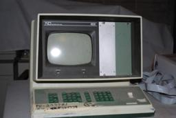](images/ND600-01.jpg)
[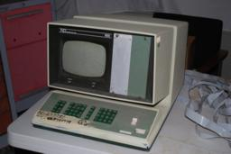](images/ND600-02.jpg)
[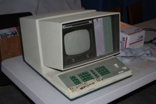](images/ND600-03.jpg)
[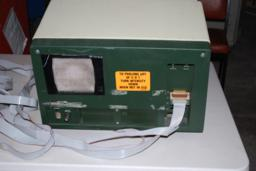](images/ND600-04.jpg)
[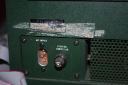](images/ND600-05.jpg)
[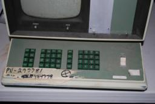](images/ND600-06.jpg)
[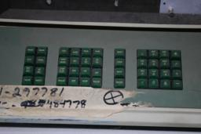](images/ND600-07.jpg)
[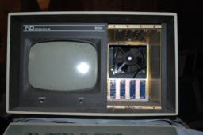](images/ND600-08.jpg)
[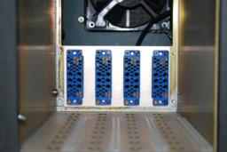](images/ND600-09.jpg)
[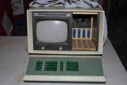](images/ND600-10.jpg)
[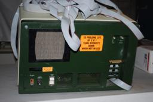](images/ND600-11.jpg)
[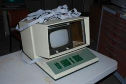](images/ND600-12.jpg)
[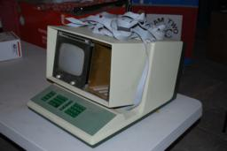](images/ND600-13.jpg)
[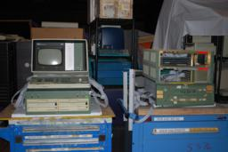](images/ND600-14.jpg)

## ND66

The ND66 succeeded the ND600. It retained the same basic architecture while
replacing the function-oriented keyboard with an ASCII keyboard. The same
former manager recalled that the ND66 became the most successful product of its
type through at least the end of the 1980s.

## References

- [Nuclear Data ND 6600 and ND 600](https://geekhack.org/index.php?topic=36435.0),
  post by former Nuclear Data Product Support Manager "ND6600," February 28,
  2013.
