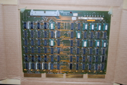
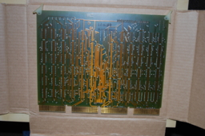
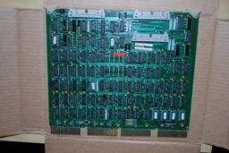
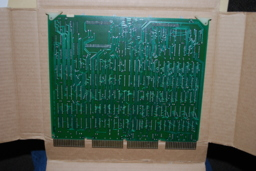
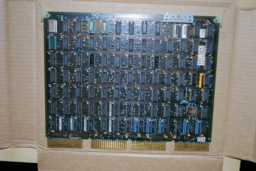
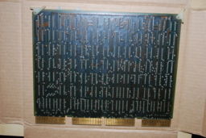
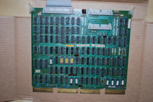
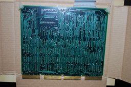
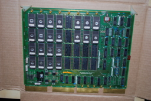
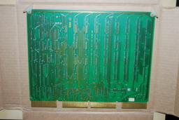

# ND6600 Multichannel Analyzer

## Overview

The ND6600 is a computer-based multichannel analyzer. The basic
system components include a system central processing unit (CPU),
system memory, a display and acquisition subsystem (DAS), a COMBUS
(defined below), printed circuit boards (listed below), and various
peripherals.

The peripherals consist of a dual hard disk and a dual floppy disk
unit. The hard disk system consists of one fixed and one removable
platter. The disks are 24-sector, 2.5-megabyte disks (2315 or IBM 5440
disk cartridge). The floppy disks have a storage capacity of 256,256
bytes and are interchangeable with the diskettes used in the IBM 3740
(Shugert SA100, Scotch 704, or equivalent) 

The solid-state random access memory (64,000 16-bit words) is
contained on two printed circuit boards. 

The COMBUS is the vehicle through which data communication between
all syste/n components is accomplished and through which power is
distributed. The COMBUS is a nondedicated, high speed, decentralized,
synchronous bus which permits direct, bidirectional data communications
between the components of the ND6600 system. It consists of a printed
circuit board, containing 100 bus lines and twenty-three 100-pin
connectors for insertion of plug-in system component 'ioards.

The system CPU directs the task performance of the device
microprocessor controllers within the ND6600 system. It consists of a
Digital Equipment Corporation (DEC) LSI-11 microcomputer with Firmware
Extended and Floating Point Instruction Sets attached to a printed
circuit board containing the System Memory Management and Interface
circuitry. The LSI-11 is a 16-bit microcomputer with the speed and
instructions of a minicomputer. Its extensive instruction set of more
than uoo instructions is equivalent to the PDP-11/35 or 40 computer
system. The only departure from the standard PDP-11/35 or 40 CPU is
the addition of two new instructions, used explicitly to access the
processor status word.

The DAS acquires data directly into system memory and provides
alphanumeric and graphic display, The DAS has its own LSI-11 and runs
under control of a program stored in this LSI-11. Thus, display and
acquisition are done independently of processing and I/O.

## Boards

The boards installed in the COMBUS are listed below.

| Board | Description |
|====|=====|
| MMI + LSI-11 | Memory management interface |
| DIB + LSI-11 | DAS interface board |
| HDB + MIP | Hard disk interface and microprocessor board |
| FDB + MIP | Floppy disk interface and microprocessor board |
| IOB | Input/output board |
| DKI | DAS keyboard control |
| GPD | General purpose display |
| DAD | DAS acquisition and display — has ports for 4 ADCs |
| SCP + MIX | Serial channel processor for communications | 
| SKM, FPM | Solid-state memory |

The I/O board provides ports for paper tape, punch, and line printer
and two ports for RS-232, 20-MA current, or optical coupling.

### Asynchronous Communication Module

ACM stands for Asynchronous Communications Module.

**Purpose**: It is a serial interface board used to connect external
devices--such as teletypes, terminals, or modems--to Nuclear
Data's minicomputer-based systems (like the ND6600 or ND7000
series).

**Part Number 50-1086-00**: This specific revision was common in their
later PDP-11 based systems or their proprietary acquisition
workstations.

**Operation**: It manages the data flow (UART) between the high-speed
system bus and the slower serial peripherals used by physicists to
output spectrum data or input commands. 

Specific documentation for the Nuclear Data 50-1086-00 board is rare,
but these boards typically use a standard layout for baud rate
selection. In most Nuclear Data asynchronous modules (ACM) from the
late 70s/early 80s, the baud rate is controlled by a set of Berg
jumpers or a DIP switch located near the top edge of the board.

#### Likely Jumper Location

Look for a group of pins labeled J1 or W1 near the UART crystal
oscillator (the silver rectangular component). On boards of this era,
the baud rate is usually set per channel using a binary combination.

#### Typical Nuclear Data Baud Rate Table

While you should verify by looking for silk-screened markings on the
PCB, Nuclear Data systems often used this standard configuration for
serial ports:

| Baud Rate | Jumper Positions (Example) |
|====|====|
| 9600            | All jumpers removed (or high binary) |
| 4800            | Jumper 1 ON |
| 2400            | Jumper 2 ON |
| 1200            | Jumpers 1 & 2 ON |
| 300             | Jumper 3 ON |

#### Verification Tips

**Identify the Baud Rate Generator**: Look for a chip with a part number
like MC14411 or COM8116. The jumpers will be physically located right
next to this chip.

**Factory Default**: Most of these modules were factory-set to 9600 or
1200 baud for teletype compatibility.

### Bus Data Interface

The ND-BDI (Bus Data Interface) board, part number 50-1136-01,
functions as a critical component in Nuclear Data (ND) minicomputer
systems like the ND6600 or ND7000. It facilitates the high-speed
transfer of digitized spectroscopy data between the system's central
processing bus and other internal modules, ensuring data stream
synchronization in multi-processor configurations. 

### Display Memory Generator

The ND-DMG (Display Memory Generator) board, part number 50-1109-02,
functions as a video and graphics controller within Nuclear Data
multichannel analyzer systems like the ND6600 or ND7000 [1.2]. Its key
roles include generating real-time high-resolution graphical output of
radioactive decay spectra, managing alphanumeric data overlays, and
interfacing with the system's main data bus to convert acquisition
data into a video signal [1.2]. More information is available on the
Canberra Industries website.

The ND-DMG 50-1109-02 does not use a single-chip LSI (Large Scale
Integration) controller like the 40-pin 6845. Instead, this board
utilizes a discrete logic implementation for video generation, which
was a hallmark of Nuclear Data's high-precision engineering in that
era.

#### Design of the ND-DMG Video Controller

Instead of a dedicated CRT controller chip, the board uses a series of
14-pin and 16-pin TTL integrated circuits (74-series logic) to
synthesize the display signals manually. This "hard-wired" approach
provided the extreme speed and precise timing needed for scientific
instrumentation that off-the-shelf chips of the time couldn't always
match.

**Baud Rate/Timing**: The timing is likely driven by a crystal oscillator
combined with frequency dividers (e.g., 74LS161 or 74LS163 counters)
to generate horizontal and vertical sync pulses.

**Memory Addressing**: Addressing for the display memory is handled by
discrete counters and multiplexers that scan through the RAM to fetch
pixel data for the CRT beam.

**Video Generation**: High-speed Shift Registers (likely 74LS165 or
74LS166) take parallel data from the memory and shift it out as a
serial bitstream to create the dots on the screen.

**Character Generation**: Since there is no LSI character generator, this
board likely uses PROMs (Programmable Read-Only Memory) in small DIP
packages to store the bit-patterns for letters and numbers. 

#### Typcal Functions for ND-DMG Connectors

On a Display Memory Generator board, these connectors are usually
dedicated to the three core needs of a laboratory CRT:

Video Output Signal (Analog/TTL):
- One connector is the primary output to the monitor.
- Pins 1-3: Often carry the Composite Video or separate H-Sync/V-Sync
  signals.
- Ground Pins: In these systems, every other pin is often tied to Ground
  to reduce signal noise (crosstalk).

**Identify the Output**: Look for a 74-series chip near a connector
labeled 74LS123 (Monostable Multivibrator) or 7406 (Buffer). These are
commonly used as the final output stage for video and sync pulses.

### Display Processing Module

The ND-DPM 50-1127-03 is a Display Processing Module from Nuclear
Data, Inc. This board works with the ND-DMG board to process raw data
counts into visual vectors and histograms for multichannel analyzers,
handling vector and graphics handling, coordinate calculation, and
sub-system communication. Like other boards in the series, it utilizes
dense discrete logic with 74-series TTL chips and integrates local
memory (RAM).

Specific documentation for the Nuclear Data ND-DPM 50-1127-03 board is
required for the exact pinout, but the connectors likely manage
internal system communication and data synchronization.

#### Likely Functions of the Berg Connectors

These are generally used for internal data links or control signals
specific to the Nuclear Data architecture.

Three 34-pin and 50-pin Berg connectors handle system data, display
control, and the main computer interface, while a 10-pin box header is
likely used for front panel auxiliary functions or status indicators.

### Memory Control Module

The ND-MCM 50-1138-03 is a Memory Control Module (MCM) from Nuclear
Data, Inc., designed for high-speed data acquisition and managing the
storage of radiation event counts in their multichannel analyzer (MCA)
systems like the ND6600 or ND7000. It functions as the "brain" for the
system's histogramming memory, coordinating with the ND-BDI (Bus
Interface) to transfer processed spectra to the main computer for
analysis.

# Rebuilding a Complete System

To form a complete, functional Nuclear Data ND6600 or ND7000 system,
you have several of the specialized "backend" and display components,
but you are missing the "front-end" data conversion and the "brain" of
the computer itself.

Based on the boards we've discussed (ACM for serial, BDI for bus
interface, DMG & DPM for display, and MCM for memory control), here
are the critical missing pieces:

## The CPU Board (The Brain)

The ND6600 was built around a DEC PDP-11/04 or 11/34 minicomputer.

Missing: You need the central processor board (often labeled LSI-11 or
a specific ND-CPU variant). Without this, the other boards have no
instructions to follow.

## The ADC (Analog-to-Digital Converter)

In nuclear spectroscopy, this is the most important part of the "front
end."

Missing: A board like the ND-ADC (50-xxxx). This board takes the
analog pulses from a radiation detector (like a Germanium or Sodium
Iodide detector) and converts them into digital values that the MCM
and BDI boards can then process.

## The Physical Memory (RAM Storage)

While you have the Memory Control Module (MCM), that board only
directs the traffic.

Missing: The actual Bulk Memory or Core/MOS Memory boards. These are
large PCBs covered almost entirely in identical RAM chips. This is
where the actual "histogram" (the spectrum data) is stored while it's
being collected.

## The Backplane / Chassis

Missing: The ND-Bus Backplane. These boards don't use standard modern
slots; they plug into a proprietary wire-wrapped or multi-layer
backplane that provides the specific power and data paths between the
DPM, DMG, and MCM.

## The Preamplifier / Amplifier (External)

Missing: While usually external "NIM" modules, the system requires a
Spectroscopy Amplifier to shape the signals before they ever reach the
boards you have.

Summary Checklist of Physical Hardware Missing:

| Category    | Specific Item                       | Likely Part Number |
|====|====|====|
| Input       | ADC (Analog to Digital Converter)   | ND-ADC 50-1033 (or similar) |
| Interface   | ND812-to-Bus Cable/Board            | kND812 Interface Module |
| Cabling     | 50-pin Ribbon "DataWay" Cables      | Custom Nuclear Data cables |
| Bus Grant   | Bus Continuity Jumpers              | "G-Cards" or "Grant Cards" |
| Frontend    | Spectroscopy Amplifier              | ND570, Ortec 572, etc. |

=========================================================================

<https://user.xmission.com/~legalize/tmp/vintage/nuclearData/nd812/DSC_0272.jpg>

the board in DSC_0272.jpg is the ND-FDC 50-1106-01 (Floppy Disk
Controller).

you have a "smart" controller. By including a Z80 CPU alongside the
Western Digital FD1771B-01, Nuclear Data offloaded the entire file
system and disk timing overhead from the main ND812 or ND6600
processor.

The Controller IC: Western Digital FD1771B-01

Technology: This was the first-generation LSI floppy controller. The
"B" variant is specifically for Single Density (FM) encoding.

Date Code 7719: Manufactured in the 19th week of 1977. This fits
perfectly with the transition period between the older discrete logic
controllers and the later 179X-series double-density controllers.

Function: It handles the low-level disk tasks: head positioning
(seek/step), CRC generation, and bit-stream synchronization.

The Z80 Co-Processor

Role: The Z80 acts as an I/O Processor. In these high-end lab systems,
the main computer would send a high-level command (like "Read Sector
5") to the FDC board. The Z80 would then execute its own internal
firmware (stored in the nearby PROMs) to manage the FD1771 and handle
the data buffering.

Memory: Near the Z80, you should see some SRAM (likely 2114 chips) and
EPROMs (likely 2708 or 2716) which contain the Z80's operating code.

Why this setup?

Nuclear Data used this "Intelligent Controller" approach to make their
storage hardware bus-independent. By using a Z80, they could use the
same basic FDC board design for both their 12-bit ND812 and their
16-bit ND6600 systems just by changing the "bridge" logic or firmware.

This is a very sophisticated board for 1977. It basically functions as
a small computer dedicated entirely to talking to the floppy drives.

That 45-0265 label confirms this is a Nuclear Data Firmware ROM
specifically for the ND-FDC floppy controller.

Role of the 45-0265 EPROM

In Nuclear Data's nomenclature, "45-xxxx" part numbers were reserved
for programmed firmware. This specific ROM contains the Z80 bootstrap
and command interpreter

System Function: When the main ND812 or ND6600 computer powers on, it
sends a "Boot" command to the Z80 on this board. The Z80 then executes
the instructions in this 45-0265 ROM to:

1. Initialize the FD1771 controller.
2. Seek the floppy drive head to Track 0.
3. Read the "boot sector" from the 8-inch disk into the local RAM.
Transfer that data over the bus to the main computer's memory to start
the OS (likely MIDAS or BPL).

Technical Context

Capacity: This is likely a 2708 (1KB) or 2716 (2KB) EPROM, which was
the standard size for Z80 boot code in 1977.

The "Black Hole" Connection: Since this came from Los Alamos, this
firmware is likely configured for the IBM 3740 Single Density format,
which was the standard for high-reliability data interchange in
government labs at the time.

    there is space on the board for a second socket, but it is not
    populated with a socket

That suggests your board is a single-ROM configuration, which was
common for specific "target" systems where the entire Z80 instruction
set for the disk controller could fit into a single 2KB EPROM (likely
a 2716).

What this tells us about the board:

- Revision Level: This is likely an earlier or more streamlined
  version of the ND-FDC. Later versions often required more code space
  (two ROMs) to support complex features like Double Density or
  Multi-tasking I/O.
- Operating Mode: With a single ROM and the FD1771 (Single Density)
  chip, this board is strictly an FM (Frequency Modulation)
  controller. It would only be able to read and write 8-inch floppies
  formatted in the standard IBM 3740 format (approximately 250KB per
  disk).
- The "Black Hole" Context: In the 1970s, Los Alamos and other
  national labs prioritized data interchangeability. The 1771-based
  single-density format was the "universal" standard; a disk written
  on this Nuclear Data machine could be physically moved to a DEC
  PDP-11 or a Xerox computer and remain readable.

## Documentation

- [The ND6600 Computer in Fusion-Energy Research](docs/6628418.pdf), K. G. Young, December 1982
