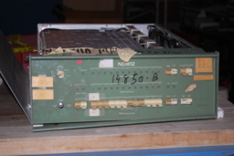
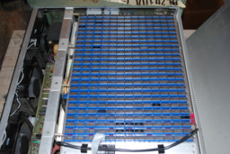
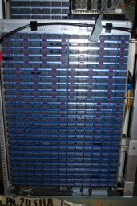

# ND812 Minicomputer

## Overview

The 12-bit **ND812**, produced by Nuclear Data, Inc., was a commercial minicomputer developed for the scientific computing market. Nuclear Data introduced it in 1970 at a price under $10,000 (about $77,000 in 2024 dollars).

**Type**: Minicomputer  
**Release Date**: 1970  
**Price**: $10,000 (1970)

## Images

[](images/ND812_front_panel.jpg)
[](images/ND812_cpu_board_1.jpg)
[](images/ND812_cpu_board_2.jpg)

## Description

### ND812 Registers

The programming model consists of the following registers:

**Main Accumulators** (12 bits each):
- **J** accumulator
- **K** accumulator

**Sub-Accumulators** (12 bits each):
- **R** accumulator
- **S** accumulator

**Program Counter** (12 bits):
- **PC** (Program Counter)

**Status Flags**:
- **O** - Overflow bit (bit 10)
- **F** - Flag bit (bit 11)

**Internal Registers** (not accessible by code):
- **IR** - Instruction register (12 bits)
- **MR** - Memory register (12 bits)
- **MAR** - Memory address register (12 bits)

All registers are 12 bits wide. Bits within the word are numbered from most significant bit (bit 11) to least significant bit (bit 0).

### Architecture

The architecture has a simple programmed I/O bus, plus a DMA channel. The programmed I/O bus typically runs low to medium-speed peripherals, such as printers, teletypes, paper tape punches and readers, while DMA is used for cathode ray tube screens with a light pen, analog-to-digital converters, digital-to-analog converters, tape drives, disk drives.

The word size, 12 bits, is large enough to handle unsigned integers from 0 to 4095 - wide enough for controlling simple machinery. This is also enough to handle signed numbers from -2048 to +2047. This is higher precision than a slide rule or most analog computers. Twelve bits could also store two six-bit characters (note, six-bit isn't enough for two cases, unlike "fuller" ASCII character set). "ND Code" was one such 6-bit character encoding that included upper-case alphabetic, digit, a subset of punctuation and a few control characters.

The ND812's basic configuration has a main memory of 4,096 twelve-bit words with a 2 microsecond cycle time. Memory is expandable to 16K words in 4K word increments.

A rich set of arithmetic and logical operations are provided for the main accumulators and instructions are provided to exchange data between the main and sub accumulators. Conditional execution is provided through "skip" instructions. A condition is tested and the subsequent instruction is either executed or skipped depending on the result of the test. The subsequent instruction is usually a jump instruction when more than one instruction is needed for the case where the test fails.

## Input/Output

The I/O facilities include programmable interrupts with 4-levels of priority that can trap to any location in the first 4K words of memory. I/O can transmit 12 or 24 bits, receive 12 or 24 bits, or transmit and receive 12 bits in a cycle. I/O instructions include 4 bits for creating pulses for peripheral control. I/O peripherals can be attached via 76 signal connector that allows for direct memory access by peripherals. DMA is accomplished by "cycle stealing" from the CPU to store words directly into the core memory system.

### Supported Peripherals

Nuclear Data provided interfaces to the following peripherals:

**Bulk storage devices:**
- Diablo Model 31 standard density disk cartridge
- Diablo Model 31 high density disk cartridge
- EDP fixed-head disk models 3008, 3016, 3032, 3064, or 3120

**Magnetic tape I/O devices:**
- Magnetic cassette tape
- PEC 7-track magnetic tape
- PEC 9-track magnetic tape

**Paper tape I/O devices:**
- Superior Electric Model TRP125-5 photoelectric tape reader (125 char/sec)
- Dataterm Model HS300 photoelectric tape reader (300 char/sec)
- Remex Model RPF1150B photoelectric tape reader (200 char/sec)
- Remex Model RPF1075B mylar tape punch (75 char/sec)
- Tally Model 1504 paper tape reader (60 char/sec)
- Tally Model 1505 paper tape punch (60 char/sec)
- Teletype Model BRPE11 paper tape punch (110 char/sec)

**Hard copy I/O devices:**
- Data Products Model 2410 line printer
- Centronics Model 101 line printer (165 char/sec)
- Franklin Model 1220 printer (20 lines/sec)
- Franklin Model 1230 printer (30 lines/sec)
- Hewlett-Packard Model 5050A printer (20 lines/sec)
- Hewlett-Packard Model 5055A printer (10 lines/sec)
- Calcomp digital incremental plotter

## Programming Facilities

The ND812 did not have an operating system, just a front panel and run and halt switches. The I/O facility allowed for peripherals to directly load programs into memory while the computer was halted and not executing instructions. Another option was to enter a short loader program that would be used to bootstrap the desired program from a peripheral such as a teletype or paper tape reader. Since core memory is non-volatile, shutting off the computer did not result in data or program loss.

A number of system programs were made available by Nuclear Data for use with the ND812: BASC-12 assembler, symbolic text editor, NUTRAN interpreter, and disk-based symbolic text editor.

### BASC-12 Assembler

An assembler called BASC-12 was provided. BASC-12 was a two-pass assembler, with an optional third pass. Pass one generates a symbol table, pass two produces a binary output tape and pass three provides a listing of the program.

A sample of the assembler from the Principles of Programming the ND812 Computer manual is shown below:

```
/Input two unequal numbers "A" and "B", compare the two numbers
/and determine which is larger, and output a literal statement
/"A > B", or "B > A" as applicable.
/
/Input and store values for A & B
                *200
Start,          TIF                     /Clear TTY flag
                JPS     Input           /Get value for A
                STJ     A
                JPS     Input           /Get value for B
                STJ     B
/
/Determine which of the two values is larger
                LDJ     A
                SBJ     B               /Subtract B from A
                SIP     J               /Test for A positive
                JMP     BRAN            /No! B > A
                LDJ     ABCST           /Yes! A > B
                SKIP                    /Skip next instruction
BRAN,           LDJ     BACST
/
/Set up and output expression
/
                JPS     OUT
                STOP
                JMP     START
/
/Working or data storage area
/
A,              0                       /Constant A
B,              0                       /Constant B
ABCST,          AB                      /Address of A > B literal
BACST,          BA                      /Address of B > A literal
C260,           260                     /ASCII zone constant
/
/Input routine + ASCII zone strip
/
Input,          0                       /Entry point
                TIS
                JMP     .-1
                TRF
                TCP                     /Echo input at teletype
                TOS
                JMP     .-1
                SBJ     C260
                JMP@    INPUT
/
/Output routine - Output ASCII expression
/
Out,            0                       /Entry point
                STJ     LOOP+1
                LDJ     C5              /Set number of character constant
                STJ     CTR
/
/Output data loop
/
Loop,           TWLDJ
                0
                TCP
                TOS
                JMP     .-1
                ISZ     LOOP+1
                DSZ     CTR             /Test for all characters out
                JMP     LOOP            /No
                JMP@    Out             /Return
C5,             5
CTR,            0
/
/Output messages
/
AB,             215
                212
                301     /A
                276     />
                302     /B
BA,             215
                212
                302     /B
                276     />
                301     /A
$                                       /End character
```

### NUTRAN

NUTRAN, a conversational, FORTRAN-like language, was provided. NUTRAN was intended for general scientific programming. A sample of NUTRAN is shown below:

```
1 PRINT 'INPUT VALUES FOR X AND Y'
2 INPUT X,Y
3 Z=X+Y
4 PRINT 'X+Y= ',Z
5 STOP
```

An example of the conversational nature of NUTRAN is shown below. `>` is the command prompt and `:` is the input prompt.

```
>1.G
INPUT VALUES FOR X AND Y
:3
:2
X+Y=    .5000000E  1

>
```

## Instruction Formats

The instruction set consists of single and double word instructions. Operands can be immediate, direct or indirect. Immediate operands are encoded directly in the instruction as a literal value. Direct operands are encoded as the address of the operand. Indirect operands encode the address of the word containing a pointer to the operand.

### Single Word Instructions

| Bit Position | Field | Width |
|--------------|-------|-------|
| 0-3 | Operation | 4 bits |
| 4 | Direct/Indirect | 1 bit |
| 5 | +/- | 1 bit |
| 6-11 | Displacement | 6 bits |

The displacement and sign bit allow single word instructions to address locations between -63 and +63 of the location of the instruction. Bit 4 of the instruction allows for a choice between indirect and direct addressing. When the displacement is used as an indirect address, the contents of the location which is +/-63 locations from the instruction location is used as a pointer to the actual operand.

Many single word instructions do not reference memory and use bits 4 and 5 as part of the specification of the operation.

#### Literal Format

| Bit Position | Field | Width |
|--------------|-------|-------|
| 0-3 | Operation | 4 bits |
| 4-5 | Instruction | 2 bits |
| 6-11 | Literal | 6 bits |

#### Group 1 Format

| Bit Position | Field | Width |
|--------------|-------|-------|
| 0-3 | 0010 (fixed) | 4 bits |
| 4 | K register affected | 1 bit |
| 5 | J register affected | 1 bit |
| 6-7 | Shift/Rotate | 2 bits |
| 8-11 | Shift Count | 4 bits |

Group 1 instructions perform arithmetic, logical, exchange and shifting functions on the accumulator registers. This includes hardware multiply and divide instructions. Bit 4 is set if the K register is affected. Bit 5 is set if the J register is affected. Both bits are set if both registers are affected.

#### Group 2 Format

| Bit Position | Field | Width |
|--------------|-------|-------|
| 0-3 | 0011 (fixed) | 4 bits |
| 4 | K register affected | 1 bit |
| 5 | J register affected | 1 bit |
| 6 | Overflow | 1 bit |
| 7 | Complement Set | 1 bit |
| 8 | Complement Clear | 1 bit |
| 9-11 | Condition | 3 bits |

Group 2 format instructions test for internal conditions of the J and K accumulator registers, manipulate the overflow and flag status bits and provide complement, increment and negation operations on the J and K accumulator registers. Bits 9, 10 and 11 select the condition to be tested.

### Two Word Instructions

**Word 1:**

| Bit Position | Field | Width |
|--------------|-------|-------|
| 0-2 | Operation | 3 bits |
| 3-6 | Instruction | 4 bits |
| 7 | Indirect | 1 bit |
| 8 | K/J Accumulator | 1 bit |
| 9 | Change Fields | 1 bit |
| 10-11 | MF1, MF2 | 2 bits |

**Word 2:**

| Bit Position | Field | Width |
|--------------|-------|-------|
| 0-11 | Absolute Address | 12 bits |

Bit 9, Change Fields, inhibits the absolute address from referencing a different field than the one containing the instruction. When bit 8 is 1, the upper accumulator K is used with the instruction, otherwise the lower accumulator J is used. When bit 7 is 1, indirect addressing is used, otherwise direct addressing is used.

### Status Word Format

| Bit Position | Field | Width |
|--------------|-------|-------|
| 0 | Flag | 1 bit |
| 1 | Overflow | 1 bit |
| 2-3 | JPS (MF0, MF1) | 2 bits |
| 4-5 | Int (MF1, MF2) | 2 bits |
| 6 | IONL | 1 bit |
| 7 | IONA | 1 bit |
| 8 | IONB | 1 bit |
| 9 | IONH | 1 bit |
| 10-11 | Current Execution (MF1, MF2) | 2 bits |

The status register does not exist as a distinct register. It is the contents of several groups of indicators that are all stored in the J register when desired. The JPS and Int bits hold the current field contents that would be used during a JPS instruction or interrupt. The flag and overflow bits can be set explicitly from the J register contents with the RFOV instruction, but the other bits must be set by distinct instructions.

### Subroutines

The ND812 processor provides a simple stack for operands, but doesn't use this mechanism for storing subroutine return addresses. Instead, the return address is stored in the target of the `JPS` instruction and then the `PC` register is updated to point to the location following the stored return address. To return from the subroutine, an indirect jump through the initial location of the subroutine restores the program counter to the instruction following the `JPS` instruction.

## Instruction Set

### Memory Reference Instructions

| Assembler Mnemonic | Octal Code | Description | Registers Affected |
|--------------------|------------|-------------|-------------------|
| ANDF | 2000 | AND with J, Forward | J |
| LDJ | 5000 | Load J | J |
| TWLDJ | 0500 | Load J | J |
| STJ | 5400 | Store J | Memory |
| TWSTJ | 0540 | Store J | Memory |
| TWLDK | 0510 | Load K | K |
| TWSTK | 0550 | Store K | Memory |
| ADJ | 4400 | Add to J | J, OV |
| TWADJ | 0440 | Add to J | J, OV |
| SBJ | 4000 | Subtract from J | J, OV |
| TWSBJ | 0400 | Subtract from J | J, OV |
| TWADK | 0450 | Add to K | K, OV |
| TWSBK | 0410 | Subtract from K | K, OV |
| ISZ | 3400 | Increment memory and skip if zero | Memory, PC |
| TWISZ | 0340 | Increment memory and skip if zero | Memory, PC |
| DSZ | 3000 | Decrement memory and skip if zero | Memory, PC |
| TWDSZ | 0300 | Decrement memory and skip if zero | Memory, PC |
| SMJ | 2400 | Skip if memory not equal to J | PC |
| TWSMJ | 0240 | Skip if memory not equal to J | PC |
| TWSMK | 0250 | Skip if memory not equal to K | PC |
| JMP | 6000 | Unconditional jump | PC |
| TWJMP | 0600 | Unconditional jump | PC |
| JPS | 6400 | Jump to subroutine | Memory, PC |
| TWJPS | 0640 | Jump to subroutine | Memory, PC |
| XCT | 7000 | Execute instruction | |

### Logical Operations

| Assembler Mnemonic | Octal Code | Description | Registers Affected |
|--------------------|------------|-------------|-------------------|
| AND J | 1100 | Logical AND J,K into J | J |
| AND K | 1200 | Logical AND J,K into K | K |
| AND JK | 1300 | Logical AND J,K into J,K | J, K |

### Arithmetic Operations on Accumulators

| Assembler Mnemonic | Octal Code | Description | Registers Affected |
|--------------------|------------|-------------|-------------------|
| AJK J | 1120 | (J + K) to J | J, OV |
| NAJK J | 1130 | -(J + K) to J | J, OV |
| SJK J | 1121 | (J - K) to J | J, OV |
| NSJK J | 1131 | -(J - K) to J | J, OV |
| ADR J | 1122 | (R + J) to J | J, OV |
| NADR J | 1132 | -(R + J) to J | J, OV |
| ADS J | 1124 | (S + J) to J | J, OV |
| NADS J | 1134 | -(S + J) to J | J, OV |
| SBR J | 1123 | (R - J) to J | J, OV |
| NSBR J | 1133 | -(R - J) to J | J, OV |
| SBS J | 1125 | (S - J) to J | J, OV |
| NSBS J | 1135 | -(S - J) to J | J, OV |
| AJK K | 1220 | (J + K) to K | K, OV |
| NAJK K | 1230 | -(J + K) to K | K, OV |
| SJK K | 1221 | (J - K) to K | K, OV |
| NSJK K | 1231 | -(J - K) to K | K, OV |
| ADR K | 1222 | (R + K) to K | K, OV |
| NADR K | 1232 | -(R + K) to K | K, OV |
| ADS K | 1224 | (S + K) to K | K, OV |
| NADS K | 1234 | -(S + K) to K | K, OV |
| SBR K | 1223 | (R - K) to K | K, OV |
| NSBR K | 1233 | -(R - K) to K | K, OV |
| SBS K | 1225 | (S - K) to K | K, OV |
| NSBS K | 1235 | -(S - K) to K | K, OV |
| AJK JK | 1320 | (J + K) to J,K | J, K, OV |
| NAJK JK | 1330 | (J + K) to J,K | J, K, OV |
| SJK JK | 1321 | (J - K) to J,K | J, K, OV |
| NSJK JK | 1331 | -(J - K) to J,K | J, K, OV |
| MPY | 1000 | Multiply J by K into R, S | J, K, R, S, OV |
| DIV | 1001 | Divide J,K by R into J, K | J, K, R, S, OV |

### Shift/Rotate Instructions

| Assembler Mnemonic | Octal Code | Description | Registers Affected |
|--------------------|------------|-------------|-------------------|
| SFTZ J | 1140 | Shift J left N | J |
| SFTZ K | 1240 | Shift K left N | K |
| SFTZ JK | 1340 | Shift J,K left N | J, K |
| ROTD J | 1160 | Rotate J left N | J |
| ROTD K | 1260 | Rotate K left N | K |
| ROTD JK | 1360 | Rotate J,K left N | J,K |

### Load and Exchange Operations

| Assembler Mnemonic | Octal Code | Description | Registers Affected |
|--------------------|------------|-------------|-------------------|
| LJSW | 1010 | Load J from switch register | J |
| LRF J | 1101 | Load R from J | R |
| LJFR | 1102 | Load J from R | J |
| EXJR | 1103 | Exchange J and R | J, R |
| LSFK | 1201 | Load S from K | S |
| LKFS | 1202 | Load K from S | K |
| EXKS | 1203 | Exchange K and S | K, S |
| LKFJ | 1204 | Load K from J | K |
| EXJK | 1374 | Exchange J and K | J, K |
| LRSFJK | 1301 | Load R, S from J, K | R, S |
| LJKFRS | 1302 | Load J, K from R, S | J, K |
| EXJRKS | 1303 | Exchange J, K and R, S | J, K, R, S |
| LJST | 1011 | Load status register into J | J |
| RFOV | 1002 | Read Flag, OV from J | J |

### Conditional Skips

| Assembler Mnemonic | Octal Code | Description | Registers Affected |
|--------------------|------------|-------------|-------------------|
| SIZ J | 1505 | Skip if J equals zero | PC |
| SIZ K | 1605 | Skip if K equals zero | PC |
| SIZ JK | 1705 | Skip if both J and K equals zero | PC |
| SNZ J | 1501 | Skip if J not equal zero | PC |
| SNZ K | 1601 | Skip if K not equal zero | PC |
| SNZ JK | 1701 | Skip if J or K not equal zero | PC |
| SIP J | 1501 | Skip if J positive | PC |
| SIP K | 1602 | Skip if K positive | PC |
| SIP JK | 1702 | Skip if both J and K positive | PC |
| SIN J | 1506 | Skip if J negative | PC |
| SIN K | 1606 | Skip if J negative | PC |
| SIN JK | 1706 | Skip if both J and K negative | PC |

### Clear, Complement, Increment and Set

| Assembler Mnemonic | Octal Code | Description | Registers Affected |
|--------------------|------------|-------------|-------------------|
| CLR J | 1510 | Clear J | J |
| CLR K | 1610 | Clear K | K |
| CLR JK | 1710 | Clear J, K | J, K |
| CMP J | 1520 | Complement J | J |
| CMP K | 1620 | Complement K | K |
| CMP JK | 1720 | Complement J, K | J, K |
| SET J | 1530 | Set J to -1 | J |
| SET K | 1630 | Set K to -1 | K |
| SET JK | 1730 | Set J, K to -1 | J, K |

### Overflow Bit Instructions

| Assembler Mnemonic | Octal Code | Description | Registers Affected |
|--------------------|------------|-------------|-------------------|
| SIZ O | 1445 | Skip if overflow zero | PC |
| SNZ O | 1441 | Skip if overflow set | PC |
| CLR O | 1450 | Clear overflow | OV |
| CMP O | 1460 | Complement overflow | OV |
| SET O | 1470 | Set overflow | OV |

### Flag Bit Instructions

| Assembler Mnemonic | Octal Code | Description | Registers Affected |
|--------------------|------------|-------------|-------------------|
| SIZ | 1405 | Skip if flag zero | PC |
| SNZ | 1401 | Skip if flag set | PC |
| CLR | 1410 | Clear flag | F |
| CMP | 1420 | Complement flag | F |
| SET | 1430 | Set flag | F |

### Increment and Negate

| Assembler Mnemonic | Octal Code | Description | Registers Affected |
|--------------------|------------|-------------|-------------------|
| INC J | 1504 | Increment J | J |
| INC K | 1604 | Increment K | K |
| INC JK | 1704 | Increment J, K | J, K |
| NEG J | 1524 | Negate J | J |
| NEG K | 1624 | Negate K | K |
| NEG JK | 1724 | Negate J, K | J, K |

### Interrupt Instructions

| Assembler Mnemonic | Octal Code | Description | Registers Affected |
|--------------------|------------|-------------|-------------------|
| IONH | 1004 | Enable interrupt level H | |
| IONA | 1006 | Enable interrupt level A, H | |
| IONB | 1005 | Enable interrupt level B, H | |
| IONN | 1007 | Enable all interrupt levels | |
| IOFF | 1003 | Disable all interrupts | |

### Powerfail Logic Instructions

| Assembler Mnemonic | Octal Code | Description | Registers Affected |
|--------------------|------------|-------------|-------------------|
| PION | 1500 | Powerfail on | |
| PIOF | 1600 | Powerfail off | |
| SKPL | 1440 | Skip on power low | PC |

### Literal Instructions

| Assembler Mnemonic | Octal Code | Description | Registers Affected |
|--------------------|------------|-------------|-------------------|
| ANDL | 2100 | AND literal with J | J |
| ADDL | 2200 | Add literal to J | J |
| SUBL | 2300 | Subtract literal from J | J |

### INT and JPS Register Instructions

| Assembler Mnemonic | Octal Code | Description | Registers Affected |
|--------------------|------------|-------------|-------------------|
| LDREG | 7720 | Load JPS from J, INT from K | |
| LDJK | 7721 | Load JPS to J, INT to K | J, K |
| RJIB | 7722 | Set JPS and INT status | |

### Teletype System

| Assembler Mnemonic | Octal Code | Description | Registers Affected |
|--------------------|------------|-------------|-------------------|
| TIS | 7404 | Skip if keyboard ready | PC |
| TIR | 7402 | Load keyboard into J | J |
| TIF | 7401 | Keyboard-reader fetch | |
| TRF | 7403 | Keyboard read-fetch | J |
| TOS | 7414 | Skip if printer-punch ready | PC |
| TOC | 7411 | Clear flag | |
| TCP | 7413 | Clear flag, print-punch | |
| TOP | 7412 | Print-punch | |

### High-Speed Paper Tape

| Assembler Mnemonic | Octal Code | Description | Registers Affected |
|--------------------|------------|-------------|-------------------|
| HIS | 7424 | Skip HS reader ready | PC |
| HIR | 7422 | Clear flag; read HS buffer | J |
| HIF | 7421 | HS reader fetch | |
| HRF | 7423 | HS reader read-fetch | J |
| HOS | 7434 | Skip if HS punch ready | PC |
| HOL | 7432 | Clear flag; load buffer from J | |
| HOP | 7431 | Punch on HS punch | |
| HLP | 7433 | Load and punch HS punch | |

### Magnetic Cassette Tape System

| Assembler Mnemonic | Octal Code | Description | Registers Affected |
|--------------------|------------|-------------|-------------------|
| CSLCT1 | 7601 | Place cassette 1 on-line | |
| CSLCT2 | 7602 | Place cassette 2 on-line | |
| CSLCT3 | 7604 | Place cassette 3 on-line | |
| CSTR | 0740, 0124 | Selected TWIO skip if transport ready | PC |
| CSFM | 0740, 0104 | Skip on filemark | PC |
| CSET | 0740, 0110 | Skip if transport at end of tape | PC |
| CSNE | 0740, 0122 | Skip if no error | PC |
| CSBT | 0740, 0130 | Skip if transport at beginning of tape | PC |
| CCLF | 0740, 0141 | Clear all cassette control flags | |
| CWFM | 0740, 0151 | Write file mark | |
| CSWR | 0740, 0152 | Skip if write ready | PC |
| CWRT | 0740, 0154 | Write J into buffer | |
| CSRR | 0740, 0142 | Skip if ready | PC |
| CRDT | 0740, 0144 | Read buffer into J | J |
| CHSF | 0740, 0101 | High speed forward to EOT | |
| CSPF | 0740, 0102 | Space forward to filemark | |
| CHSR | 0740, 0121 | High-speed reverse to BOT | |

### Miscellaneous Instructions

| Assembler Mnemonic | Octal Code | Description | Registers Affected |
|--------------------|------------|-------------|-------------------|
| STOP | 0000 | Stop execution | |
| SKIP | 1442 | Unconditional skip | PC |
| IDLE | 1400 | One cycle delay | |
| TWIO | 0740 | Two-word I/O | |

## References

- Datamation, Volume 16, 1970, page 84
- Principles of Programming the ND812 Computer, 1971, page G-1

## External Links

- [ND812 Brochure](http://bitsavers.org/pdf/nd/ND812/ND812_Brochure.pdf)
- [Principles of Programming the ND812 Computer](http://bitsavers.org/pdf/nd/ND812/ND812_Prog.pdf), 1971
- [NUTRAN User and Programmers Guide](http://bitsavers.org/pdf/nd/ND812/IM41-0059-00_NUTRAN_User_and_Programmers_Guide_Nov72.pdf), November, 1972
- [Software Instruction Manual BASC-12 General Assembler](http://bitsavers.trailing-edge.com/pdf/nd/ND812/IM41-0001_Software_Instruction_Manual_BASC-12_General_Assembler_Jan71.pdf), January, 1971
