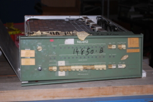
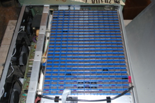
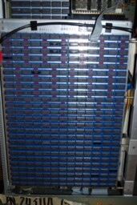
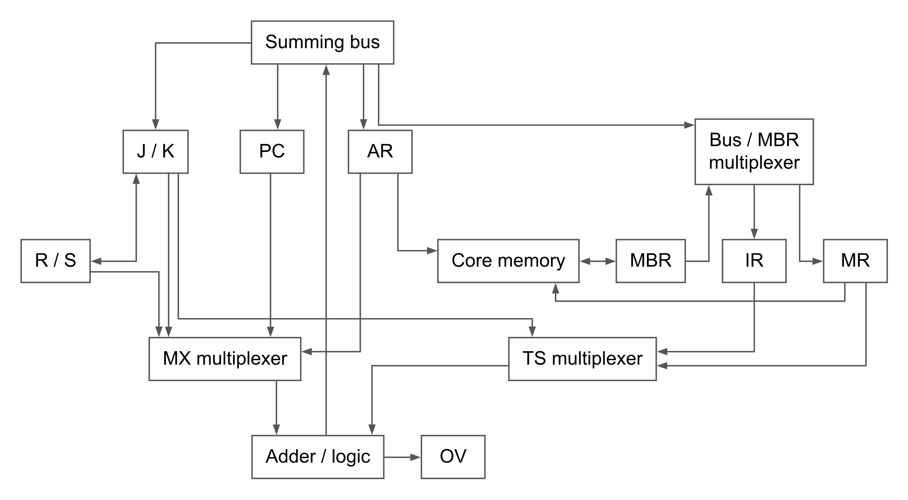

# ND812 Minicomputer

## Overview

The 12-bit **ND812**, produced by Nuclear Data, Inc., was a commercial minicomputer developed for the scientific computing market. Nuclear Data introduced it in 1970 at a price under $10,000 (about $77,000 in 2024 dollars).

**Type**: Minicomputer  
**Release Date**: 1970  
**Price**: $10,000 (1970)

## Images

[](images/ND812_front_panel.jpg)
[](images/ND812_cpu_board_1.jpg)
[](images/ND812_cpu_board_2.jpg)

# Architecture

The ND812 is a 12-bit, single-address, synchronous, sequential, parallel
machine using two's-complement arithmetic. The programming manual describes the
machine in four major functional units: control, arithmetic/logical, memory, and
input/output. The maintenance manual and board photographs show the physical
implementation as solid-state MSI/TTL register-transfer logic spread across
dense socketed boards, with the front panel exposing the switch register,
selected register, memory register, memory field lamps, run/interrupt state, and
manual load/start controls.

The central architectural idea is that core memory, the instruction path, and
the accumulator path are all 12 bits wide. Documentation numbers bit 0 as the
most significant bit and bit 11 as the least significant bit. A 12-bit word can
hold an unsigned value from 0 to 4095, a two's-complement value from -2048 to
2047, a single 12-bit instruction word, or two packed 6-bit characters.

## Register Model

The programmer-visible arithmetic state is richer than many contemporary
12-bit minicomputers:

- **J** and **K** are the two main 12-bit accumulators. They are the registers
  loaded from and stored to memory, used for programmed I/O transfers, and used
  for most arithmetic and logical results.
- **R** and **S** are 12-bit sub-accumulators. They are not directly loaded
  from or stored to core memory, but they can exchange with or contribute to
  operations involving J and K. Hardware multiply places its result in R and S.
- **PC** is the 12-bit program counter. It holds the address of the next
  instruction within the current memory field and is normally incremented after
  fetch.
- **IR** is the 12-bit instruction register. The control unit loads fetched
  instructions here and holds them during execution.
- **AR** is the 12-bit address register, also called MAR in the programming
  manual. It selects the current core location for instruction fetches and
  operand accesses.
- **MR** is the 12-bit memory data register. It supplies memory operands to the
  arithmetic path and holds data to be written to core.
- **MBR** is the memory buffer register at the core-memory interface. Its read
  data reaches IR and MR through the bus/MBR multiplexer; it also participates
  in restoring the contents of core after a read.
- **Status state** includes the flag bit, overflow bit, memory-field state,
  interrupt enables, and related status indicators. The status state is not a
  single programmer-visible general register, but it can be sampled into J or
  restored by status-oriented instructions.

## Core Memory and Addressing

The ND812 uses magnetic core memory with a 2 microsecond cycle time. The
brochure lists 8192 12-bit words as the common supplied memory, with a 4K
minimum and expansion to 16K in 4K increments. Because a 12-bit address selects
4096 words, larger memories are organized as memory fields. The PC, AR, and
instruction address fields select a word within a field, while field-control
state selects which 4K field is active for execution, subroutine linkage, and
interrupt handling.

Memory-reference instructions come in two major forms. Single-word memory
reference instructions use a 4-bit operation field, a direct/indirect bit, a
forward/backward displacement sign, and a 6-bit relative displacement. Two-word
memory-reference instructions add an absolute 12-bit address word and field
selection controls. This gives the ND812 both compact relative addressing and a
larger absolute-address form when the program needs it.

## CPU Dataflow

The diagram is a simplified version of Figure 1-2 in the
[maintenance manual](docs/ND812_Maintenance_Manual.pdf#page=24) (PDF page 24,
printed page 1-4). It retains the register, multiplexer, arithmetic, summing-bus,
and core-memory paths, while omitting individual gate controls, timing logic,
bit-line labels, and peripheral wiring. J/K and R/S are shown as register pairs.
The editable Graphviz source is
[ND812_cpu_dataflow.dot](images/ND812_cpu_dataflow.dot).



For instruction fetch, PC passes through the MX multiplexer and adder to the
summing bus, which loads AR. AR selects the core location; the word read from
core enters MBR and passes through the bus/MBR multiplexer into IR and MR.

The MX and TS multiplexers select the arithmetic operands. The adder/logic
result returns on the summing bus to J/K, PC, AR, or the bus/MBR multiplexer;
overflow logic updates OV. A load takes data from MR through TS and the arithmetic
path into J/K. A store takes J/K through the arithmetic path, summing bus, and
bus/MBR multiplexer into MR, which supplies the core write data. R/S exchange
data with J/K and supply operands to MX.

## Input/Output

The I/O system combines programmed I/O, interrupts, and DMA. Programmed I/O can
transfer 12 or 24 bits, receive 12 or 24 bits, or transmit and receive 12 bits
with one instruction. Single-word I/O instructions provide 256 possible I/O
commands; two-word I/O instructions provide 4096 possible commands. Four
instruction bits can also generate sequential peripheral-control pulses, which
lets a single I/O instruction perform multi-function device operations.

The ND812 includes a programmable 4-level priority interrupt system that can
trap to any core location in the first 4K words of memory. DMA is available
through the peripheral connector and cycle-steals memory cycles so devices can
read, load, increment, or decrement core memory directly.

### Supported Peripherals

Nuclear Data provided interfaces to the following peripherals:

**Bulk storage devices:**
- Diablo Model 31 standard density disk cartridge
- Diablo Model 31 high density disk cartridge
- EDP fixed-head disk models 3008, 3016, 3032, 3064, or 3120

**Magnetic tape I/O devices:**
- Magnetic cassette tape
- PEC 7-track magnetic tape
- PEC 9-track magnetic tape

**Paper tape I/O devices:**
- Superior Electric Model TRP125-5 photoelectric tape reader (125 char/sec)
- Dataterm Model HS300 photoelectric tape reader (300 char/sec)
- Remex Model RPF1150B photoelectric tape reader (200 char/sec)
- Remex Model RPF1075B mylar tape punch (75 char/sec)
- Tally Model 1504 paper tape reader (60 char/sec)
- Tally Model 1505 paper tape punch (60 char/sec)
- Teletype Model BRPE11 paper tape punch (110 char/sec)

**Hard copy I/O devices:**
- Data Products Model 2410 line printer
- Centronics Model 101 line printer (165 char/sec)
- Franklin Model 1220 printer (20 lines/sec)
- Franklin Model 1230 printer (30 lines/sec)
- Hewlett-Packard Model 5050A printer (20 lines/sec)
- Hewlett-Packard Model 5055A printer (10 lines/sec)
- Calcomp digital incremental plotter

## ND812 Compared With DEC PDP-8

The ND812 and the DEC PDP-8 are both 12-bit core-memory minicomputers built
around small instruction words, indirect addressing, front-panel operation, and
skip-based conditional control. They differ most strongly in the register model
and how much data movement hardware is provided in the base machine.

A former Nuclear Data Product Support Manager characterized the ND812 as a
"PDP-8 clone" adapted for real-time work. That description captures its market
position and programming style rather than literal hardware compatibility: the
ND812's multiple accumulators, addressing modes, and integrated arithmetic
distinguish it architecturally from the PDP-8.

| Aspect | ND812 | DEC PDP-8 |
|--------|-------|-----------|
| Word size | 12 bits | 12 bits |
| Main programmer registers | Dual main accumulators J and K, plus sub-accumulators R and S | One accumulator AC plus Link; optional extended arithmetic hardware on many systems |
| Arithmetic | Two's-complement fixed-point arithmetic; hardware multiply and divide were standard features | Two's-complement add/subtract through AC and Link; multiply/divide generally required optional EAE hardware or software routines |
| Memory addressing | Single-word relative direct/indirect references plus two-word absolute references with field selection | Page-oriented memory references to zero page or current page, with indirect addressing; extended memory used instruction and data fields |
| Memory size | 4K minimum, commonly 8K supplied, expandable to 16K in 4K fields | Typically 4K base, expandable with memory-extension fields; many PDP-8 family systems reached 32K words |
| Subroutine linkage | `JPS` stores the return address in the target location, then continues at the following word | `JMS` stores the return address in the target location, then continues at the following word |
| Conditional control | Extensive skip instructions for J, K, J/K combinations, overflow, flag, and memory tests | Skip-oriented OPR and IOT instruction groups built around AC, Link, device flags, and combined micro-operations |
| I/O and interrupts | Programmed I/O with 12/24-bit transfers, 4-level priority interrupts, and DMA support | Device-specific `IOT` instructions; interrupt and data-break capabilities varied by model and options |
| Architectural flavor | More register-rich and bus/multiplexer oriented, with standard multiply/divide and priority interrupt features | More minimalist base CPU centered on AC/Link, with many capabilities supplied by options or peripheral controllers |

In short, the ND812 feels like a PDP-8-class 12-bit minicomputer expanded in the
direction of richer arithmetic registers and more integrated I/O control. The
PDP-8 is the more minimalist design: elegant, smaller in the base programmer's
model, and strongly shaped by page addressing and microcoded operate groups. The
ND812 keeps the same 12-bit minicomputer economy but spends more hardware on
accumulator paths, hardware multiply/divide, memory-field control, and I/O
priority/DMA facilities.

## Programming Facilities

The ND812 did not have an operating system, just a front panel and run and halt switches. The I/O facility allowed for peripherals to directly load programs into memory while the computer was halted and not executing instructions. Another option was to enter a short loader program that would be used to bootstrap the desired program from a peripheral such as a teletype or paper tape reader. Since core memory is non-volatile, shutting off the computer did not result in data or program loss.

A number of system programs were made available by Nuclear Data for use with the ND812: BASC-12 assembler, symbolic text editor, NUTRAN interpreter, and disk-based symbolic text editor.

In the ND4400 analyzer system, users could program the ND812 in assembly
language or NUTRAN. FORTRAN became available later, although a former ND4400
user and Nuclear Data Product Support Manager recalled that the implementation
did not work very well.

### BASC-12 Assembler

An assembler called BASC-12 was provided. BASC-12 was a two-pass assembler, with an optional third pass. Pass one generates a symbol table, pass two produces a binary output tape and pass three provides a listing of the program.

A sample of the assembler from the Principles of Programming the ND812 Computer manual is shown below:

```
/Input two unequal numbers "A" and "B", compare the two numbers
/and determine which is larger, and output a literal statement
/"A > B", or "B > A" as applicable.
/
/Input and store values for A & B
                *200
Start,          TIF                     /Clear TTY flag
                JPS     Input           /Get value for A
                STJ     A
                JPS     Input           /Get value for B
                STJ     B
/
/Determine which of the two values is larger
                LDJ     A
                SBJ     B               /Subtract B from A
                SIP     J               /Test for A positive
                JMP     BRAN            /No! B > A
                LDJ     ABCST           /Yes! A > B
                SKIP                    /Skip next instruction
BRAN,           LDJ     BACST
/
/Set up and output expression
/
                JPS     OUT
                STOP
                JMP     START
/
/Working or data storage area
/
A,              0                       /Constant A
B,              0                       /Constant B
ABCST,          AB                      /Address of A > B literal
BACST,          BA                      /Address of B > A literal
C260,           260                     /ASCII zone constant
/
/Input routine + ASCII zone strip
/
Input,          0                       /Entry point
                TIS
                JMP     .-1
                TRF
                TCP                     /Echo input at teletype
                TOS
                JMP     .-1
                SBJ     C260
                JMP@    INPUT
/
/Output routine - Output ASCII expression
/
Out,            0                       /Entry point
                STJ     LOOP+1
                LDJ     C5              /Set number of character constant
                STJ     CTR
/
/Output data loop
/
Loop,           TWLDJ
                0
                TCP
                TOS
                JMP     .-1
                ISZ     LOOP+1
                DSZ     CTR             /Test for all characters out
                JMP     LOOP            /No
                JMP@    Out             /Return
C5,             5
CTR,            0
/
/Output messages
/
AB,             215
                212
                301     /A
                276     />
                302     /B
BA,             215
                212
                302     /B
                276     />
                301     /A
$                                       /End character
```

### NUTRAN

NUTRAN, a conversational, FORTRAN-like language, was provided. NUTRAN was intended for general scientific programming. A sample of NUTRAN is shown below:

```
1 PRINT 'INPUT VALUES FOR X AND Y'
2 INPUT X,Y
3 Z=X+Y
4 PRINT 'X+Y= ',Z
5 STOP
```

An example of the conversational nature of NUTRAN is shown below. `>` is the command prompt and `:` is the input prompt.

```
>1.G
INPUT VALUES FOR X AND Y
:3
:2
X+Y=    .5000000E  1

>
```

## Instruction Formats

The instruction set consists of single and double word instructions. Operands can be immediate, direct or indirect. Immediate operands are encoded directly in the instruction as a literal value. Direct operands are encoded as the address of the operand. Indirect operands encode the address of the word containing a pointer to the operand.

### Single Word Instructions

| Bit Position | Field | Width |
|--------------|-------|-------|
| 0-3 | Operation | 4 bits |
| 4 | Direct/Indirect | 1 bit |
| 5 | +/- | 1 bit |
| 6-11 | Displacement | 6 bits |

The displacement and sign bit allow single word instructions to address locations between -63 and +63 of the location of the instruction. Bit 4 of the instruction allows for a choice between indirect and direct addressing. When the displacement is used as an indirect address, the contents of the location which is +/-63 locations from the instruction location is used as a pointer to the actual operand.

Many single word instructions do not reference memory and use bits 4 and 5 as part of the specification of the operation.

#### Literal Format

| Bit Position | Field | Width |
|--------------|-------|-------|
| 0-3 | Operation | 4 bits |
| 4-5 | Instruction | 2 bits |
| 6-11 | Literal | 6 bits |

#### Group 1 Format

| Bit Position | Field | Width |
|--------------|-------|-------|
| 0-3 | 0010 (fixed) | 4 bits |
| 4 | K register affected | 1 bit |
| 5 | J register affected | 1 bit |
| 6-7 | Shift/Rotate | 2 bits |
| 8-11 | Shift Count | 4 bits |

Group 1 instructions perform arithmetic, logical, exchange and shifting functions on the accumulator registers. This includes hardware multiply and divide instructions. Bit 4 is set if the K register is affected. Bit 5 is set if the J register is affected. Both bits are set if both registers are affected.

#### Group 2 Format

| Bit Position | Field | Width |
|--------------|-------|-------|
| 0-3 | 0011 (fixed) | 4 bits |
| 4 | K register affected | 1 bit |
| 5 | J register affected | 1 bit |
| 6 | Overflow | 1 bit |
| 7 | Complement Set | 1 bit |
| 8 | Complement Clear | 1 bit |
| 9-11 | Condition | 3 bits |

Group 2 format instructions test for internal conditions of the J and K accumulator registers, manipulate the overflow and flag status bits and provide complement, increment and negation operations on the J and K accumulator registers. Bits 9, 10 and 11 select the condition to be tested.

### Two Word Instructions

**Word 1:**

| Bit Position | Field | Width |
|--------------|-------|-------|
| 0-2 | Operation | 3 bits |
| 3-6 | Instruction | 4 bits |
| 7 | Indirect | 1 bit |
| 8 | K/J Accumulator | 1 bit |
| 9 | Change Fields | 1 bit |
| 10-11 | MF1, MF2 | 2 bits |

**Word 2:**

| Bit Position | Field | Width |
|--------------|-------|-------|
| 0-11 | Absolute Address | 12 bits |

Bit 9, Change Fields, inhibits the absolute address from referencing a different field than the one containing the instruction. When bit 8 is 1, the upper accumulator K is used with the instruction, otherwise the lower accumulator J is used. When bit 7 is 1, indirect addressing is used, otherwise direct addressing is used.

### Status Word Format

| Bit Position | Field | Width |
|--------------|-------|-------|
| 0 | Flag | 1 bit |
| 1 | Overflow | 1 bit |
| 2-3 | JPS (MF0, MF1) | 2 bits |
| 4-5 | Int (MF1, MF2) | 2 bits |
| 6 | IONL | 1 bit |
| 7 | IONA | 1 bit |
| 8 | IONB | 1 bit |
| 9 | IONH | 1 bit |
| 10-11 | Current Execution (MF1, MF2) | 2 bits |

The status register does not exist as a distinct register. It is the contents of several groups of indicators that are all stored in the J register when desired. The JPS and Int bits hold the current field contents that would be used during a JPS instruction or interrupt. The flag and overflow bits can be set explicitly from the J register contents with the RFOV instruction, but the other bits must be set by distinct instructions.

### Subroutines

The ND812 processor provides a simple stack for operands, but doesn't use this mechanism for storing subroutine return addresses. Instead, the return address is stored in the target of the `JPS` instruction and then the `PC` register is updated to point to the location following the stored return address. To return from the subroutine, an indirect jump through the initial location of the subroutine restores the program counter to the instruction following the `JPS` instruction.

## Instruction Set

### Memory Reference Instructions

| Assembler Mnemonic | Octal Code | Description | Registers Affected |
|--------------------|------------|-------------|-------------------|
| ANDF | 2000 | AND with J, Forward | J |
| LDJ | 5000 | Load J | J |
| TWLDJ | 0500 | Load J | J |
| STJ | 5400 | Store J | Memory |
| TWSTJ | 0540 | Store J | Memory |
| TWLDK | 0510 | Load K | K |
| TWSTK | 0550 | Store K | Memory |
| ADJ | 4400 | Add to J | J, OV |
| TWADJ | 0440 | Add to J | J, OV |
| SBJ | 4000 | Subtract from J | J, OV |
| TWSBJ | 0400 | Subtract from J | J, OV |
| TWADK | 0450 | Add to K | K, OV |
| TWSBK | 0410 | Subtract from K | K, OV |
| ISZ | 3400 | Increment memory and skip if zero | Memory, PC |
| TWISZ | 0340 | Increment memory and skip if zero | Memory, PC |
| DSZ | 3000 | Decrement memory and skip if zero | Memory, PC |
| TWDSZ | 0300 | Decrement memory and skip if zero | Memory, PC |
| SMJ | 2400 | Skip if memory not equal to J | PC |
| TWSMJ | 0240 | Skip if memory not equal to J | PC |
| TWSMK | 0250 | Skip if memory not equal to K | PC |
| JMP | 6000 | Unconditional jump | PC |
| TWJMP | 0600 | Unconditional jump | PC |
| JPS | 6400 | Jump to subroutine | Memory, PC |
| TWJPS | 0640 | Jump to subroutine | Memory, PC |
| XCT | 7000 | Execute instruction | |

### Logical Operations

| Assembler Mnemonic | Octal Code | Description | Registers Affected |
|--------------------|------------|-------------|-------------------|
| AND J | 1100 | Logical AND J,K into J | J |
| AND K | 1200 | Logical AND J,K into K | K |
| AND JK | 1300 | Logical AND J,K into J,K | J, K |

### Arithmetic Operations on Accumulators

| Assembler Mnemonic | Octal Code | Description | Registers Affected |
|--------------------|------------|-------------|-------------------|
| AJK J | 1120 | (J + K) to J | J, OV |
| NAJK J | 1130 | -(J + K) to J | J, OV |
| SJK J | 1121 | (J - K) to J | J, OV |
| NSJK J | 1131 | -(J - K) to J | J, OV |
| ADR J | 1122 | (R + J) to J | J, OV |
| NADR J | 1132 | -(R + J) to J | J, OV |
| ADS J | 1124 | (S + J) to J | J, OV |
| NADS J | 1134 | -(S + J) to J | J, OV |
| SBR J | 1123 | (R - J) to J | J, OV |
| NSBR J | 1133 | -(R - J) to J | J, OV |
| SBS J | 1125 | (S - J) to J | J, OV |
| NSBS J | 1135 | -(S - J) to J | J, OV |
| AJK K | 1220 | (J + K) to K | K, OV |
| NAJK K | 1230 | -(J + K) to K | K, OV |
| SJK K | 1221 | (J - K) to K | K, OV |
| NSJK K | 1231 | -(J - K) to K | K, OV |
| ADR K | 1222 | (R + K) to K | K, OV |
| NADR K | 1232 | -(R + K) to K | K, OV |
| ADS K | 1224 | (S + K) to K | K, OV |
| NADS K | 1234 | -(S + K) to K | K, OV |
| SBR K | 1223 | (R - K) to K | K, OV |
| NSBR K | 1233 | -(R - K) to K | K, OV |
| SBS K | 1225 | (S - K) to K | K, OV |
| NSBS K | 1235 | -(S - K) to K | K, OV |
| AJK JK | 1320 | (J + K) to J,K | J, K, OV |
| NAJK JK | 1330 | (J + K) to J,K | J, K, OV |
| SJK JK | 1321 | (J - K) to J,K | J, K, OV |
| NSJK JK | 1331 | -(J - K) to J,K | J, K, OV |
| MPY | 1000 | Multiply J by K into R, S | J, K, R, S, OV |
| DIV | 1001 | Divide J,K by R into J, K | J, K, R, S, OV |

### Shift/Rotate Instructions

| Assembler Mnemonic | Octal Code | Description | Registers Affected |
|--------------------|------------|-------------|-------------------|
| SFTZ J | 1140 | Shift J left N | J |
| SFTZ K | 1240 | Shift K left N | K |
| SFTZ JK | 1340 | Shift J,K left N | J, K |
| ROTD J | 1160 | Rotate J left N | J |
| ROTD K | 1260 | Rotate K left N | K |
| ROTD JK | 1360 | Rotate J,K left N | J,K |

### Load and Exchange Operations

| Assembler Mnemonic | Octal Code | Description | Registers Affected |
|--------------------|------------|-------------|-------------------|
| LJSW | 1010 | Load J from switch register | J |
| LRF J | 1101 | Load R from J | R |
| LJFR | 1102 | Load J from R | J |
| EXJR | 1103 | Exchange J and R | J, R |
| LSFK | 1201 | Load S from K | S |
| LKFS | 1202 | Load K from S | K |
| EXKS | 1203 | Exchange K and S | K, S |
| LKFJ | 1204 | Load K from J | K |
| EXJK | 1374 | Exchange J and K | J, K |
| LRSFJK | 1301 | Load R, S from J, K | R, S |
| LJKFRS | 1302 | Load J, K from R, S | J, K |
| EXJRKS | 1303 | Exchange J, K and R, S | J, K, R, S |
| LJST | 1011 | Load status register into J | J |
| RFOV | 1002 | Read Flag, OV from J | J |

### Conditional Skips

| Assembler Mnemonic | Octal Code | Description | Registers Affected |
|--------------------|------------|-------------|-------------------|
| SIZ J | 1505 | Skip if J equals zero | PC |
| SIZ K | 1605 | Skip if K equals zero | PC |
| SIZ JK | 1705 | Skip if both J and K equals zero | PC |
| SNZ J | 1501 | Skip if J not equal zero | PC |
| SNZ K | 1601 | Skip if K not equal zero | PC |
| SNZ JK | 1701 | Skip if J or K not equal zero | PC |
| SIP J | 1501 | Skip if J positive | PC |
| SIP K | 1602 | Skip if K positive | PC |
| SIP JK | 1702 | Skip if both J and K positive | PC |
| SIN J | 1506 | Skip if J negative | PC |
| SIN K | 1606 | Skip if J negative | PC |
| SIN JK | 1706 | Skip if both J and K negative | PC |

### Clear, Complement, Increment and Set

| Assembler Mnemonic | Octal Code | Description | Registers Affected |
|--------------------|------------|-------------|-------------------|
| CLR J | 1510 | Clear J | J |
| CLR K | 1610 | Clear K | K |
| CLR JK | 1710 | Clear J, K | J, K |
| CMP J | 1520 | Complement J | J |
| CMP K | 1620 | Complement K | K |
| CMP JK | 1720 | Complement J, K | J, K |
| SET J | 1530 | Set J to -1 | J |
| SET K | 1630 | Set K to -1 | K |
| SET JK | 1730 | Set J, K to -1 | J, K |

### Overflow Bit Instructions

| Assembler Mnemonic | Octal Code | Description | Registers Affected |
|--------------------|------------|-------------|-------------------|
| SIZ O | 1445 | Skip if overflow zero | PC |
| SNZ O | 1441 | Skip if overflow set | PC |
| CLR O | 1450 | Clear overflow | OV |
| CMP O | 1460 | Complement overflow | OV |
| SET O | 1470 | Set overflow | OV |

### Flag Bit Instructions

| Assembler Mnemonic | Octal Code | Description | Registers Affected |
|--------------------|------------|-------------|-------------------|
| SIZ | 1405 | Skip if flag zero | PC |
| SNZ | 1401 | Skip if flag set | PC |
| CLR | 1410 | Clear flag | F |
| CMP | 1420 | Complement flag | F |
| SET | 1430 | Set flag | F |

### Increment and Negate

| Assembler Mnemonic | Octal Code | Description | Registers Affected |
|--------------------|------------|-------------|-------------------|
| INC J | 1504 | Increment J | J |
| INC K | 1604 | Increment K | K |
| INC JK | 1704 | Increment J, K | J, K |
| NEG J | 1524 | Negate J | J |
| NEG K | 1624 | Negate K | K |
| NEG JK | 1724 | Negate J, K | J, K |

### Interrupt Instructions

| Assembler Mnemonic | Octal Code | Description | Registers Affected |
|--------------------|------------|-------------|-------------------|
| IONH | 1004 | Enable interrupt level H | |
| IONA | 1006 | Enable interrupt level A, H | |
| IONB | 1005 | Enable interrupt level B, H | |
| IONN | 1007 | Enable all interrupt levels | |
| IOFF | 1003 | Disable all interrupts | |

### Powerfail Logic Instructions

| Assembler Mnemonic | Octal Code | Description | Registers Affected |
|--------------------|------------|-------------|-------------------|
| PION | 1500 | Powerfail on | |
| PIOF | 1600 | Powerfail off | |
| SKPL | 1440 | Skip on power low | PC |

### Literal Instructions

| Assembler Mnemonic | Octal Code | Description | Registers Affected |
|--------------------|------------|-------------|-------------------|
| ANDL | 2100 | AND literal with J | J |
| ADDL | 2200 | Add literal to J | J |
| SUBL | 2300 | Subtract literal from J | J |

### INT and JPS Register Instructions

| Assembler Mnemonic | Octal Code | Description | Registers Affected |
|--------------------|------------|-------------|-------------------|
| LDREG | 7720 | Load JPS from J, INT from K | |
| LDJK | 7721 | Load JPS to J, INT to K | J, K |
| RJIB | 7722 | Set JPS and INT status | |

### Teletype System

| Assembler Mnemonic | Octal Code | Description | Registers Affected |
|--------------------|------------|-------------|-------------------|
| TIS | 7404 | Skip if keyboard ready | PC |
| TIR | 7402 | Load keyboard into J | J |
| TIF | 7401 | Keyboard-reader fetch | |
| TRF | 7403 | Keyboard read-fetch | J |
| TOS | 7414 | Skip if printer-punch ready | PC |
| TOC | 7411 | Clear flag | |
| TCP | 7413 | Clear flag, print-punch | |
| TOP | 7412 | Print-punch | |

### High-Speed Paper Tape

| Assembler Mnemonic | Octal Code | Description | Registers Affected |
|--------------------|------------|-------------|-------------------|
| HIS | 7424 | Skip HS reader ready | PC |
| HIR | 7422 | Clear flag; read HS buffer | J |
| HIF | 7421 | HS reader fetch | |
| HRF | 7423 | HS reader read-fetch | J |
| HOS | 7434 | Skip if HS punch ready | PC |
| HOL | 7432 | Clear flag; load buffer from J | |
| HOP | 7431 | Punch on HS punch | |
| HLP | 7433 | Load and punch HS punch | |

### Magnetic Cassette Tape System

| Assembler Mnemonic | Octal Code | Description | Registers Affected |
|--------------------|------------|-------------|-------------------|
| CSLCT1 | 7601 | Place cassette 1 on-line | |
| CSLCT2 | 7602 | Place cassette 2 on-line | |
| CSLCT3 | 7604 | Place cassette 3 on-line | |
| CSTR | 0740, 0124 | Selected TWIO skip if transport ready | PC |
| CSFM | 0740, 0104 | Skip on filemark | PC |
| CSET | 0740, 0110 | Skip if transport at end of tape | PC |
| CSNE | 0740, 0122 | Skip if no error | PC |
| CSBT | 0740, 0130 | Skip if transport at beginning of tape | PC |
| CCLF | 0740, 0141 | Clear all cassette control flags | |
| CWFM | 0740, 0151 | Write file mark | |
| CSWR | 0740, 0152 | Skip if write ready | PC |
| CWRT | 0740, 0154 | Write J into buffer | |
| CSRR | 0740, 0142 | Skip if ready | PC |
| CRDT | 0740, 0144 | Read buffer into J | J |
| CHSF | 0740, 0101 | High speed forward to EOT | |
| CSPF | 0740, 0102 | Space forward to filemark | |
| CHSR | 0740, 0121 | High-speed reverse to BOT | |

### Miscellaneous Instructions

| Assembler Mnemonic | Octal Code | Description | Registers Affected |
|--------------------|------------|-------------|-------------------|
| STOP | 0000 | Stop execution | |
| SKIP | 1442 | Unconditional skip | PC |
| IDLE | 1400 | One cycle delay | |
| TWIO | 0740 | Two-word I/O | |

## References

- Datamation, Volume 16, 1970, page 84
- Principles of Programming the ND812 Computer, 1971, page G-1
- [Nuclear Data ND 6600 and ND 600](https://geekhack.org/index.php?topic=36435.0),
  post by former Nuclear Data Product Support Manager "ND6600," February 28,
  2013.

## External Links

- [ND812 Brochure](http://bitsavers.org/pdf/nd/ND812/ND812_Brochure.pdf)
- [Principles of Programming the ND812 Computer](http://bitsavers.org/pdf/nd/ND812/ND812_Prog.pdf), 1971
- [NUTRAN User and Programmers Guide](http://bitsavers.org/pdf/nd/ND812/IM41-0059-00_NUTRAN_User_and_Programmers_Guide_Nov72.pdf), November, 1972
- [Software Instruction Manual BASC-12 General Assembler](http://bitsavers.trailing-edge.com/pdf/nd/ND812/IM41-0001_Software_Instruction_Manual_BASC-12_General_Assembler_Jan71.pdf), January, 1971
